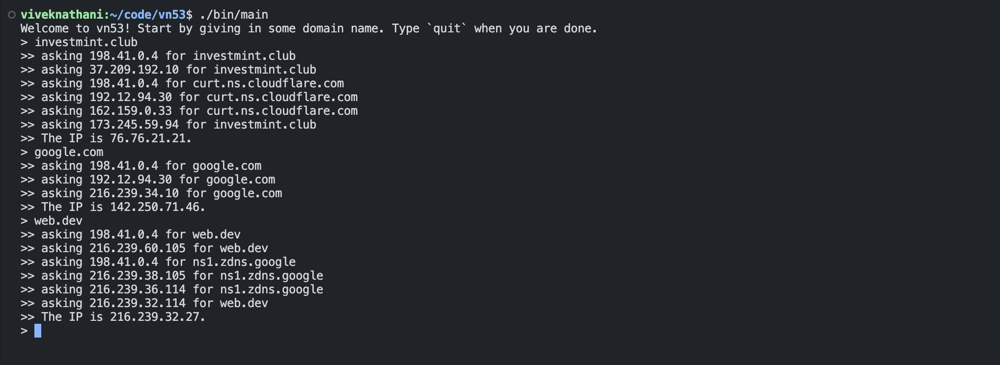

# vn53

A DNS resolver made for fun!

   

## motivation

I came across Julia Evans' post on [implementing DNS in a weekend](https://implement-dns.wizardzines.com/). I spent some more time reading her blogposts on DNS. Cloudflare has some great articles too. After this, I was convinced I had to write this on my own. I blogged about it over [here](https://vivekn.dev/blog/dns).

### additional things that can be done with this

1. Add a caching layer in accordance with the TTL
2. Cover more (or all) record types.
3. Try to break it, find vulnerabilities!

## license

[MIT](./LICENSE)